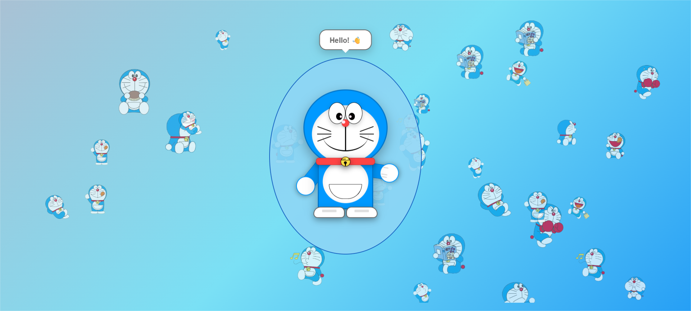

# 🎨 Real Doraemon - こんにちは!

This project is a **fun front-end web project** that draws and animates **Doraemon** using only **HTML, CSS, and JavaScript**.  
It includes interactive elements like speech bubbles, waving animation, and a responsive layout.

---

## 📂 Project Structure

.
├── index.html   # Main HTML file
├── style.css    # Styling for Doraemon and animations
└── script.js    # JavaScript for interactivity

---

## 🚀 Live Demo
👉 [Live Demo](https://nitesh-shaw-098.github.io/Doraemon/)  


---

## ⚡ Features
- Pure **HTML + CSS + JS** implementation.
- Doraemon’s **head, body, arms, and feet** are drawn with CSS shapes.
- **Interactive wave animation** on Doraemon’s right arm.
- **Speech bubble** with a friendly "こんにちは! 👋" greeting.
- Fully **responsive** and works across devices.

---

## 🛠️ How to Run Locally
1. Clone the repository:
   ```bash
   git clone https://github.com/your-username/doraemon-project.git

2. Navigate to the project folder:

   ```bash
   cd doraemon-project
   ```
3. Open `index.html` in your browser.

---

## 🌍 Deploying to GitHub Pages

1. Push your project to a GitHub repository.
2. Go to **Settings > Pages**.
3. Under **Source**, select the branch (usually `main`) and folder (`/root`).
4. Save, and GitHub will generate a **Live Demo link** like:

   ```
   https://your-username.github.io/doraemon-project/
   ```

---

## 🌟 Future Enhancements

* Add more **animations** (blinking eyes, walking).
* Switch between **different Doraemon expressions**.
* Add **background scenes** for a livelier effect.

---

## 📸 Preview



---

## 📝 License

This project is open-source and available under the **MIT License**.


